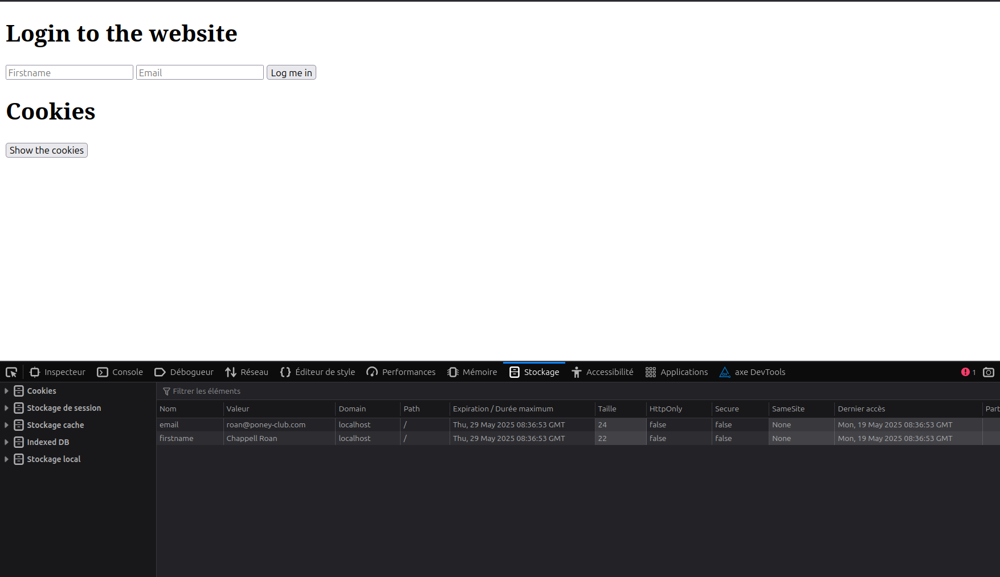

# 
Cookies & local storage

## Table of Contents

- [Objectives](#objectives)

- [Description](#Descritpion)

- [Requirements](#requirements)

- [Mandatory Tasks](#mandatory-tasks)

## Learning Objectives

- Understand how to create cookies using Javascript
- Learn how to set specific settings for the cookie
- Learn how to read cookies with Javascript
- How to use js-cookie for easy cookie manipulation
- How to use the browser web storage
- The differences between local storage and session storage

## Description

In this project, we learn about Cookirs and Local Storage

## Requirements

- Allowed editors: `vi`, `vim`, `emacs`, `VSCode`
- All your files should end with a new line
- A `README.md` file, at the root of the folder of the project, is mandatory
- Your code should use the `js` extension
- All of your code will be compiled/executed on Ubuntu 18.04 using Node 12.x and npm 6.x
- src/index.js should stay empty - all your Javascript must be in your HTML, inside `<script>` tag

## Mandatory Tasks

  
### 0. Create basic cookie

### 1. Create cookie with expiration date and specific path

### 2. Read cookie

### 3. Delete cookie and mini application

### 4. Use js-cookie

### 5. Local storage

### 6. Session storage

  

  

### 7. Advanced use of web storage

## Author

Julie Dedieu <julie.dedieu1@gmail.com>
