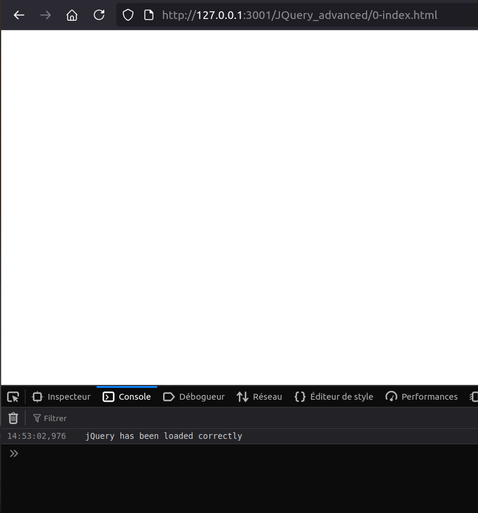
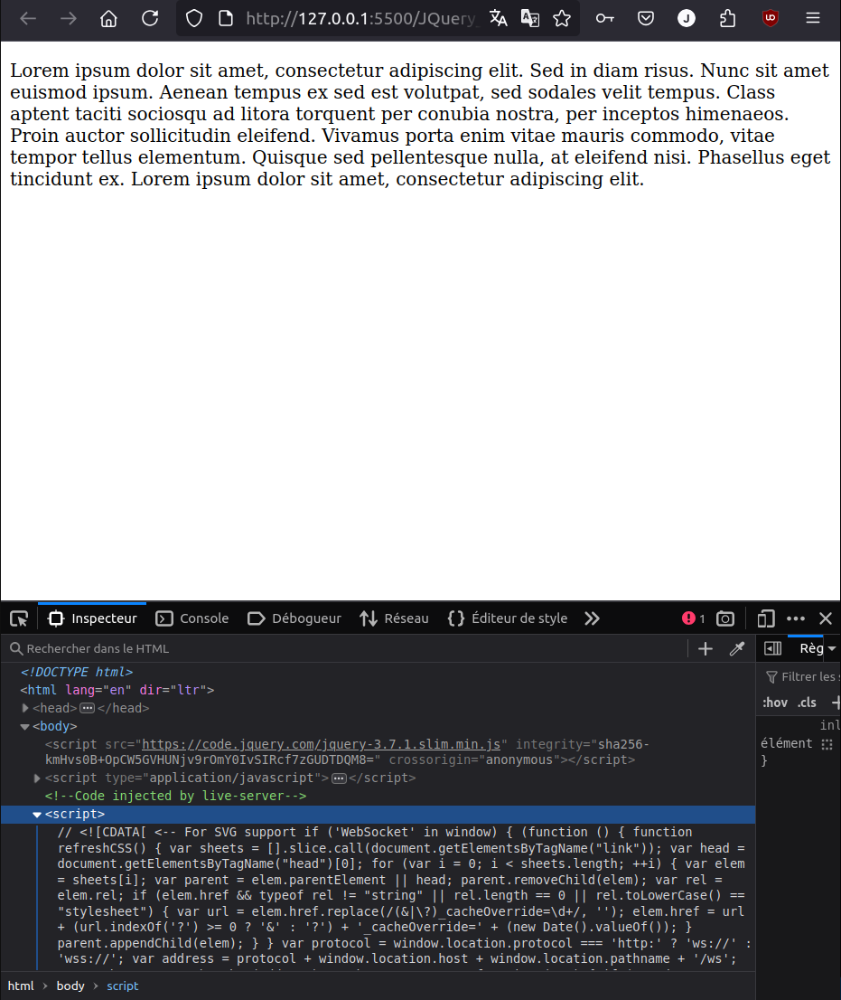
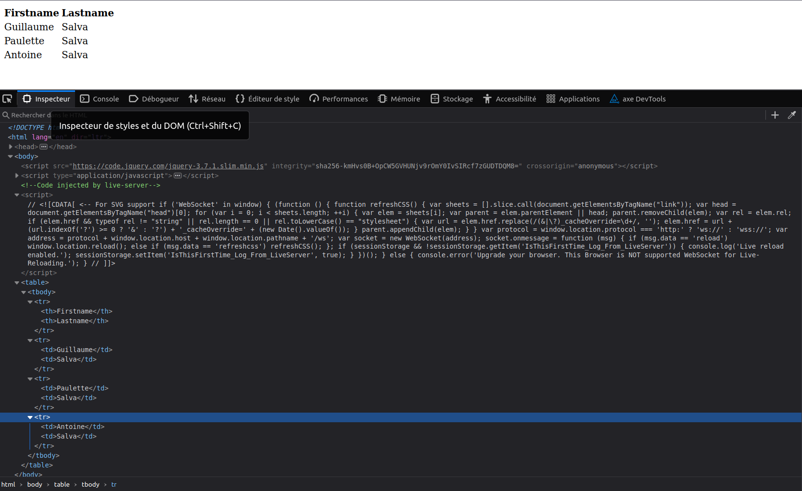
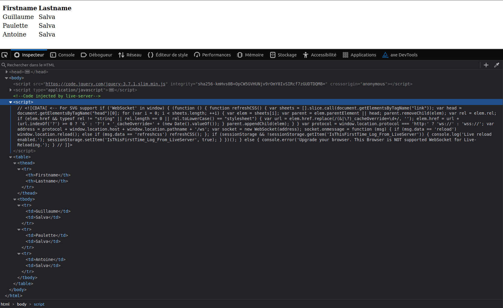
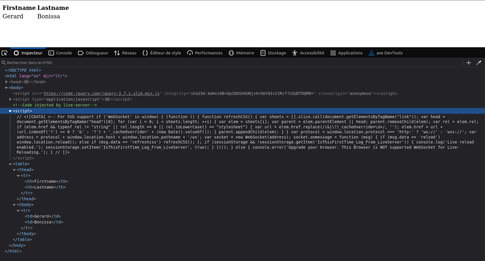
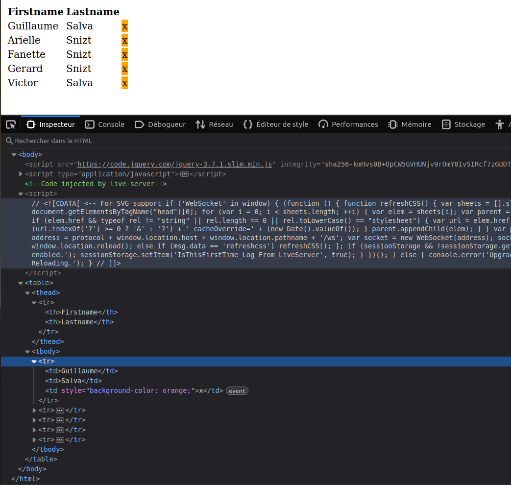
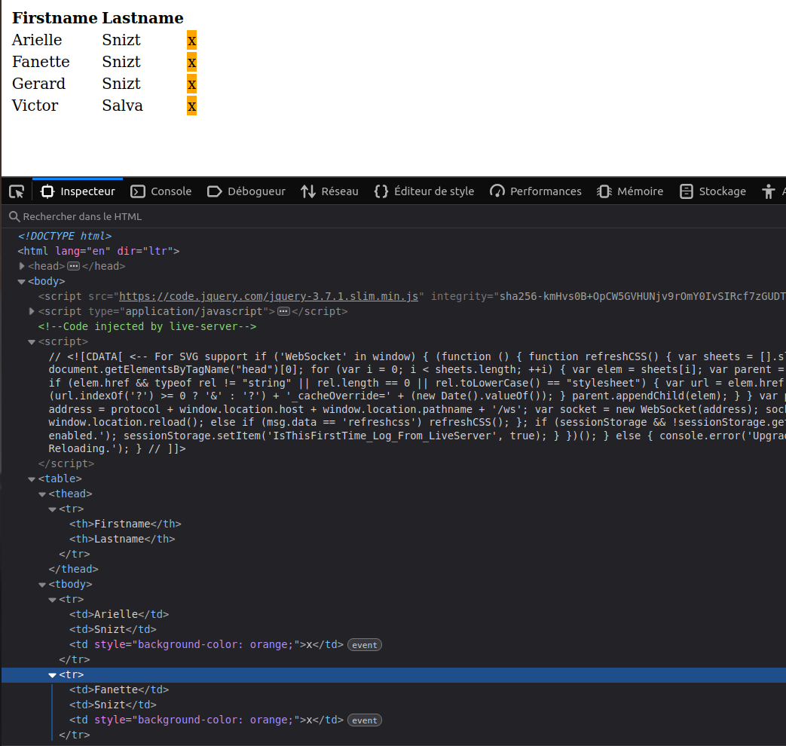

# 
jQuery advanced

  

## Table of Contents

  

- [Objectives](#objectives)

- [Description](#Descritpion)

- [Requirements](#requirements)

- [Mandatory Tasks](#Mandatory-Tasks)

  

## Learning Objectives

  

- Learn how to load jQuery from a CDN in a page

- Learn the different ways to create DOM elements with jQuery

- Learn how to modify elements

- Learn how to add new elements to a page with different positions

- Learn how to add a click handler on an element

- Learn how to send GET, POST, DELETE or any type of AJAX query with jQuery

- Learn how to create a pagination

## Description

In this project, we learn about Advanced jQuery

## Requirements

- Allowed editors: `vi`, `vim`, `emacs`, `VSCode`

- All your files should end with a new line

- A README.md file, at the root of the folder of the project, is mandatory

## Mandatory Tasks

  
0. `Setup your dev environment`

1. `Creating a DOM element`

2. `Creating multiple DOM elements at once`

3. `Chain DOM elements`

4. `HTML function`

5. `Click attribute and remove function`

6. `Val, before, and prepend functions`

7. `Query - Setup your dev environment`

8. `Pagination`

9. `Wrap/unwrap`

10. `Another Get API`

11. `Post query`

12. `Delete query`

## Author

Julie Dedieu <julie.dedieu1@gmail.com>