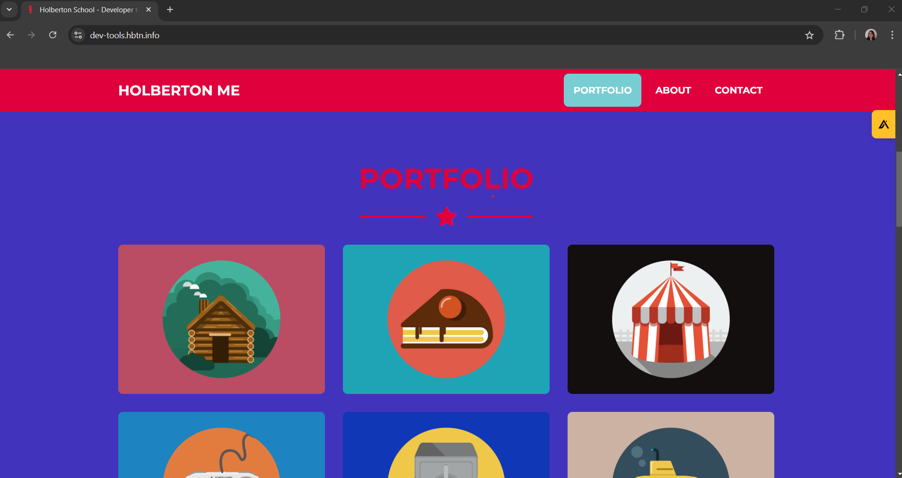

# <p align="center">Developer Tools</p>

<div align="center">
<a href="./images/cover.png">

</a>
</div>

- [Learning Objectives](#Learning_Objectives)
- [Requirements](#Requirements)
- [Mandatory Tasks](#Mandatory_Tasks)

## Learning Objectives

* What Developer Tools in your browser are
* How to open the Developer Tools on Chrome, Firefox, Safari, and Edge.
* How to use the elements tab to edit HTML and CSS
* How to audit a page according to the tips suggested by Lighthouse
* How to create and run snippets on a page
* How to get information about files and server configurations
* How to block requests
* How to know how much JavaScript or CSS is used on a page
* How to detect 404 issues
* How to move elements on a webpage

## Requirements

* A mandatory `README.md` file with meaningful information about the content, should be placed at the root folder of the project.
* Use the newest version of Google Chrome browser (78.0.3904.70 or later).
* Screenshots can be taken via the OS, not necessary via the DevTools. These screenshots are used to see how and where you are doing/playing with the DevTools. 

## Tasks

<details open>
<summary>

### Task 0. Responsive device
</summary>
<p>
Go to `https://dev-tools.hbtn.info/`

Take a screenshot of the website using the device toolbar Choose iPhone X and show the size in your screenshot (selected device or size in pixel of the rendering)
</p>

<div style="text-align: center">

</div>

</details>

<details open><summary>

### Task 1. Change the background color
</summary>

Go to https://dev-tools.hbtn.info/

Change the background-color of the body to use #`4233bd` Take a screenshot of the `PORTFOLIO` section.

<div style="text-align: center">

</div>
</details>

<details open><summary>

### Task 2. Force element state 

</summary>

Go to https://dev-tools.hbtn.info/

Force the hover state of the “cake” block in the section Portfolio Take a screenshot of it

<div style="text-align: center">

</div>
</details>

<details open><summary>

### Task 3. Copy all the styles of the button
</summary>

Go to https://dev-tools.hbtn.info/

Select the `Download me!` and copy all the CSS styling that is applied on this button.

Your answer file must contain all CSS styling one per line like this example:
```
$ head -2 3-button_styles
border-radius: 1px;
color: #FF00FF;
$
```
</details>

<details open><summary>

### Task 4. Change button styles
</summary>

Go to https://dev-tools.hbtn.info/

* All primary buttons (`btn-primary`) should have the `#0080ee` color as a background color
* All outlined buttons light (`btn-outline-light`) should have `#0020aa` for the text color
* Screenshot all buttons that changed and merge it to one image

</details>

<details open><summary>

### Task 5. Remove part of the website
</summary>
Go to https://dev-tools.hbtn.info/

Remove the `div` of the “cake” box in the section Portfolio

Take a screenshot of it
</details>

<details open><summary>

### Task 6. Where is it coming from?
</summary>

Go to https://dev-tools.hbtn.info/

* On the right panel, click on the `Computed tab`
* Then, select the `h2` with the text `ABOUT`
* Search for `margin-bottom`

Which file is that declaration coming from?
</details>

<details open><summary>

### Task 7. How many listeners
</summary>

Go to https://dev-tools.hbtn.info/

How many times click events are referenced in JavaScript files?
</details>

<details open><summary>

### Task 8. What is the HSL code
</summary>
Go to https://dev-tools.hbtn.info/

Select the primary button “Send”

What is the equivalent value of the hexadecimal background-color, in HSL?

(format of your answer should be: `hsl(<VALUES>)`;, example: `hsl(241, 23%, 24%)`; following by a new line)
</details>

<details open><summary>

### Task 9. The max-width of the container
</summary>
Go to https://dev-tools.hbtn.info/

What is the `max-width` for the first `.container` in the section “About”? (your browser width must be between 1250px and 1440px and with a zoom at 100%)

(format of your answer should be `max-width: <VALUE>`;, example: `max-width: 670px`)
</details>

<details open><summary>

### Task 10. Moving around
</summary>
Go to https://dev-tools.hbtn.info/

Switch the sections of “About” and “Portfolio”

Take a screenshot of it
</details>

<details open><summary>

### Task 11. Coverage
</summary>
Go to https://dev-tools.hbtn.info/

How big, in bytes, is the `freelancer.css` file?

Answer file must contain the value in Byte (example: `6144` for 6KB)
</details>

<details open><summary>

### Task 12. Emulate the print version of the webpage
</summary>
Go to https://dev-tools.hbtn.info/

Under Rendering, change the CSS media type emulation to “print” and take a screenshot of the home page.
</details>

<details open><summary>

### Task 13. Using the console
</summary>
Go to https://dev-tools.hbtn.info/

Select the Avatar image in the header and type `$0` in the console. Enter.

What does it return?
</details>

<details open><summary>

### Task 14. Write code in the console
</summary>
Go to https://dev-tools.hbtn.info/

Write in the console `console.log(document.title)`, what is returned?
</details>

<details open><summary>

### Task 15. Holberton web framework
</summary>
Go to https://dev-tools.hbtn.info/

Which front-end framework could we guess this page is using?

In your answer file only put the letter of the multiple choice answer from below:

    A. React JS
    B. Material Design
    C. Bootstrap
    D. Angular JS

</details>

<details open><summary>

### Task 16. Homepage weight
</summary>
Go to https://dev-tools.hbtn.info/

What is the total weight of the page (with all the elements)?

Take a screenshot of it
</details>

<details open><summary>

### Task 17. Number of requests
</summary>
Go to https://dev-tools.hbtn.info/

What is the number of requests done when accessing this page?

Take a screenshot of it
</details>

<details open><summary>

### Task 18. Number of CSS files
</summary>
Go to https://dev-tools.hbtn.info/

How many CSS resources are loaded on this page?
</details>

<details open><summary>

### Task 19. Number of images
</summary>
Go to https://dev-tools.hbtn.info/

How many image resources are loaded on this page?
</details>

<details open><summary>

### Task 20. Favicon image type
</summary>
Go to https://dev-tools.hbtn.info/

What is the `type` value of the favicon image?
</details>

<details open><summary>

### Task 21. Font library
</summary>
Go to https://dev-tools.hbtn.info/

Holberton School website uses a font library for their icons, which one is it?
</details>

<details open><summary>

### Task 22. XHR calls
</summary>
Go to https://dev-tools.hbtn.info/

What is the name of the resource that generates 1 XHR calls? 
</details>

<details open><summary>

### Task 23. Audits panel
</summary>
Go to https://dev-tools.hbtn.info/

What is the notation for `Performance` (for desktop mode and no throttling - also called Lighthouse)?

Take a screenshot of it
</details>

<details open><summary>

### Task 24. Static assets
</summary>
Go to https://dev-tools.hbtn.info/

How many static assets need a better cache policy?

Take a screenshot of it
</details>

<details open><summary>

### Task 25. Accessibility
</summary>
Go to https://dev-tools.hbtn.info/

When you run an accessibility audit, what is the contrast issue?

In your answer file only put the letter of the multiple choice answer from below:

* A. Image elements do not have [alt] attributes
* B. Links do not have a discernible name
* C. Background and foreground colors do not have a sufficient contrast ratio.

</details>

<details open><summary>

### Task 26. No alt
</summary>
Go to https://dev-tools.hbtn.info/

Which classes are on the images that have no `alt` attribute?

Your answer file must contains all classes, example: `.my_class.my_second` if 2 classes
</details>

<details open><summary>

### Task 27. Best practices
</summary>
Go to https://dev-tools.hbtn.info/

Which attribute is missing on all the links with the target `_blank`?

In your answer file only put the letter of the multiple choice answer from below:

    A. `rel="noopener"`
    B. `rel="noreferrer"`
    C. A and B

</details>

<details open><summary>

### Task 28. SEO
</summary>
Go to https://dev-tools.hbtn.info/

Which `<a>` links don’t have enough text description?

Take a screenshot of it
</details>

<details open><summary>

### Task 29. Sources
</summary>
Go to https://dev-tools.hbtn.info/

The `sources` panel allow you to edit files, add breakpoints to analyse your JavaScript code and create snippets.

* Create a new snippet called `allcolors.js`
* Copy-paste the code on <a href="https://github.com/bgrins/devtools-snippets/blob/master/snippets/allcolors/allcolors.js">this page</a>
* Run the code
* Take a screenshot of the result in your console

</details>

<details open><summary>

### Task 30. Block CSS files
</summary>
Go to https://dev-tools.hbtn.info/

Block all CSS requests

Take a screenshot of it
</details>

<details open><summary>

### Task 31. Application panel
</summary>
Go to https://dev-tools.hbtn.info/

The `application` panel gives you access to the storage (cookies, sessions, cache…) and some other options as Services Workers and more recently, notifications.

What is the only key present in the session storage for this page?
</details>

<details open><summary>

### Task 32. Service workers
</summary>
Go to https://dev-tools.hbtn.info/

Does this page have any service workers? `Yes` or `No`
</details>

<details open><summary>

### Task 33. Security
</summary>
Go to https://dev-tools.hbtn.info/

The `security` panel allows you to make sure HTTPS is properly implement on a webpage.

Which organization issued the SSL certificate for this page?
</details>

<details open><summary>

### Task 34. Expiration date
</summary>
Go to https://dev-tools.hbtn.info/

When does the SSL certificate expire?

Take a screenshot of it
</details>