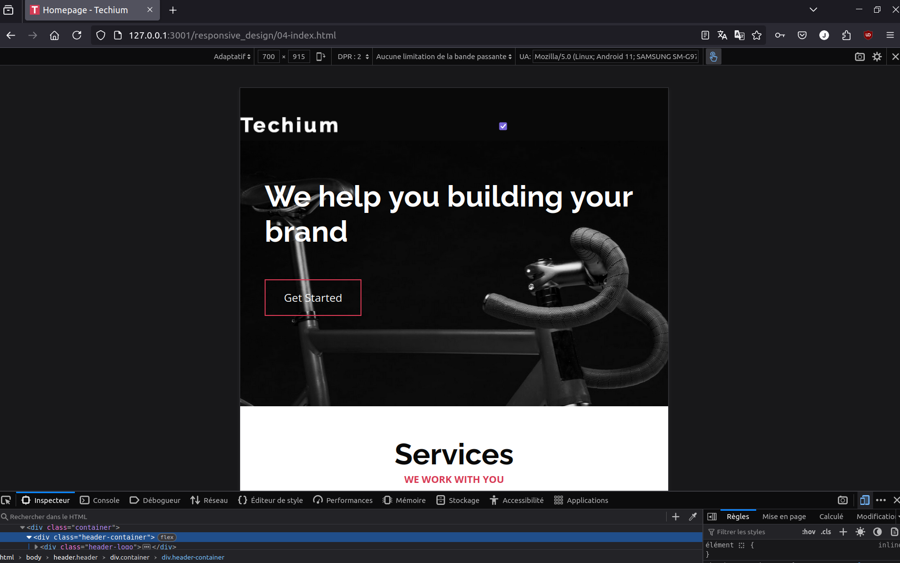

# 
Responsive Design

## Table of Contents

- [Objectives](#objectives)
- [Description](#Descritpion)
- [Requirements](#requirements)
- [Mandatory Tasks](#Mandatory-Tasks)

## Objectives

At the end of this project, you are expected to be able to explain to anyone, without the help of Google:

- Mobile-first design
- Media-queries
- Sizes to use for responsive web design
- How to make a website responsive
- The differences between responsive and adaptive design
- CSS units that are used to make elements flexible

## Description

In this project, we learn about creating responsive design

## Requirements
 
- A `README.md` file, at the root of the folder of the project is mandatory
- HTML and CSS have been rendered on Chrome 78 or more.

## Mandatory Tasks

### Task 0. Fix the hero banner
### Task 1. Make the container flexible

### Task 2. Fix layout issues

Add media queries to adapt to different screen size.

<bold>Rendering on wide screen</bold>

<bold>Rendering on screen with max-width: 767px</bold>

### Task 3. Generate images with responsive breakpoints

### Task 4. Create the mobile icon and hide the menu

Create the mobile icon and hide the menu.

<strong>Rendering on screen with max-width: 767px, the check box is the input</strong>

### Task 5. Hamburger!

Create an “hamburger” icon just with CSS.

<strong>Rendering of the hamburger on max-width: 767px</strong>

### Task 6. Add the behavior based on menu-btn state

Add the behavior based on menu-btn state.

<strong>Rendering on screen with max-width: 767px, when the input is unchecked the menu is not displayed</strong>

<strong>Rendering on screen with max-width: 767 px, when input is checked the menu block is displayed</strong>

<strong>Rendering on desktop screen, menu icon is not visible</strong>

### Task 7. Make the font size responsive

### Task 8. Improve the "Works" section

<strong>Rendering on screen of max-width: 767px</strong>

### Task 9. Improve the "Footer" section

<strong>Rendering on screen of max-width: 767px</strong>

### Task 10. Fix the top header background

<strong>Rendering of header and section-hero class elements</strong>

## Author

Julie Dedieu <julie.dedieu1@gmail.com>
